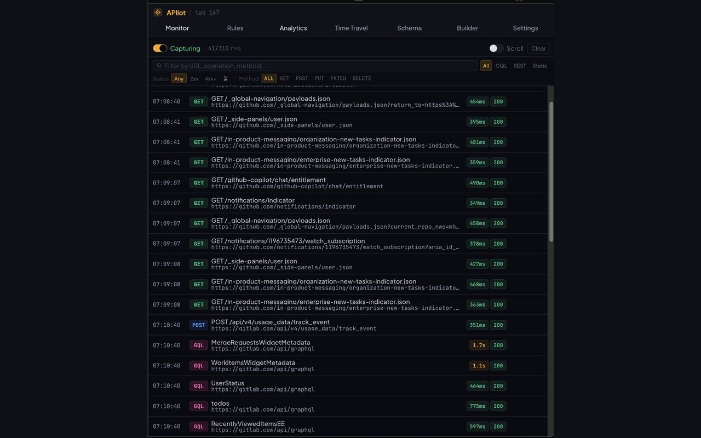
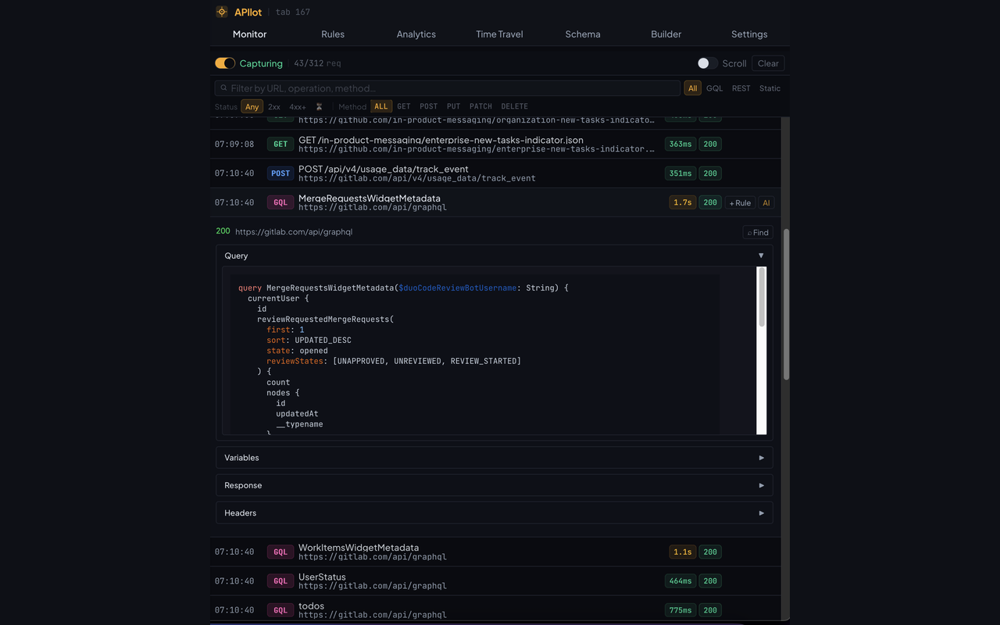
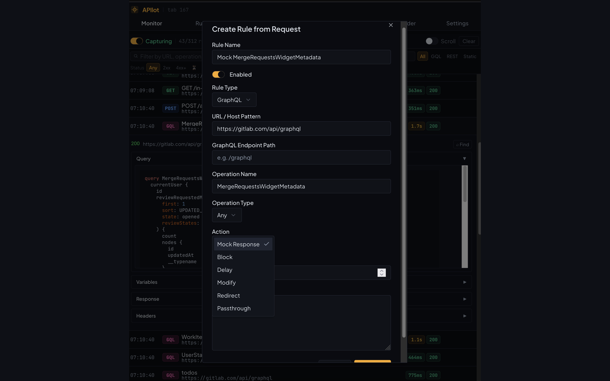
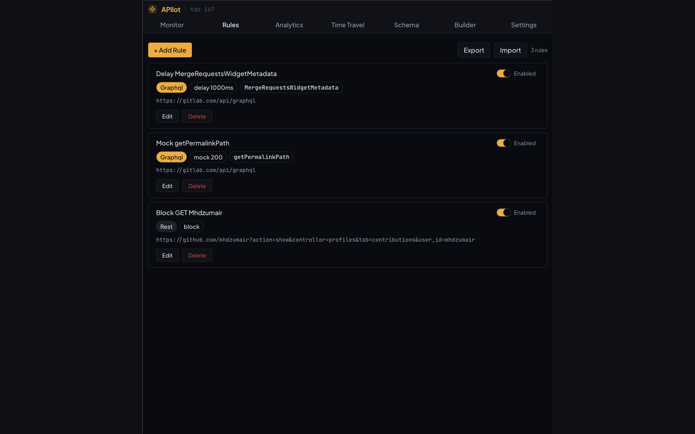
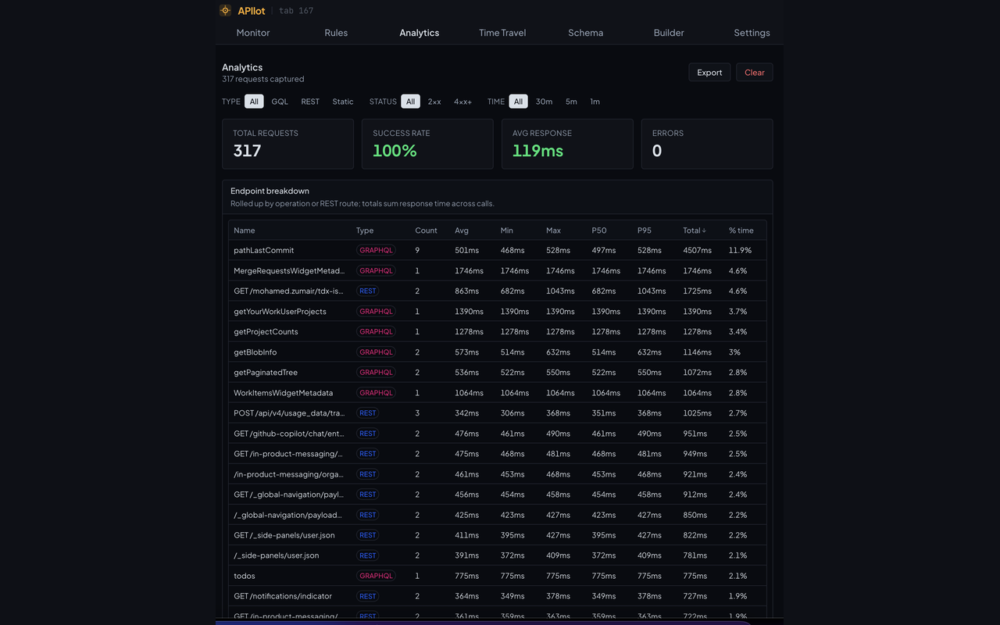

# APIlot

**Your AI copilot for API testing**

A powerful browser extension for **GraphQL**, **REST**, and **static asset** workflows—development, testing, and debugging. Lives in **browser DevTools** with AI-assisted mock generation, performance analytics, time-travel debugging, and a configurable rule engine.

| Firefox | Chrome |
|--------|--------|
| [**Install on Firefox Add-ons**](https://addons.mozilla.org/en-US/firefox/addon/apilot/) — **live** | **Chrome Web Store** — *under review* ([install from source](#from-source-development) meanwhile) |

**By:** [Mohamed Zumair](https://addons.mozilla.org/en-US/firefox/addon/apilot/) · **License:** [MIT](LICENSE) · **Privacy:** [PRIVACY.md](PRIVACY.md)

---

## Screenshots

<p align="center">
  <br />
  <sub><b>Monitor</b> — live request list, filters, and GraphQL / REST / static detection</sub>
</p>

<p align="center">
  <br />
  <sub><b>Request detail</b> — query, variables, response, and headers</sub>
</p>

<p align="center">
  <br />
  <sub><b>Rules from traffic</b> — open the rule editor prefilled from a request</sub>
</p>

<p align="center">
  <br />
  <sub><b>Rules</b> — manage mocks, delays, redirects, blocks, and more</sub>
</p>

<p align="center">
  <br />
  <sub><b>Analytics</b> — timing metrics, charts, and per-endpoint rollups (export supported)</sub>
</p>

*(Store listings use 1280×800 assets; these images are the same shots used for [AMO](https://addons.mozilla.org/en-US/firefox/addon/apilot/).)*

---

## Key features

### Request monitoring
- GraphQL and REST detection with **filters** (status, method, type, search)
- **Subframes / iframes**: traffic from embedded clients is monitored when enabled
- Rich **request/response** views; in-code **Ctrl/Cmd+F** in code blocks
- **Options** requests can be filtered from noise where appropriate

### AI-assisted mocking
- Generate mocks from captured traffic via **your** API keys
- Providers include **OpenAI**, **Anthropic**, **OpenRouter**, **Azure OpenAI**, **Google Gemini**, plus a **local / pattern-based** path (no remote LLM)
- Configure models and limits under **Settings**

### Schema explorer & query builder
- **Introspection** and execution against endpoints you choose
- Auth helpers (Bearer, API keys, custom headers) and **visual query builder**

### Rule engine
- **GraphQL**, **REST**, **both**, and **static asset** (JS/CSS/images) rule types
- Actions: **mock**, **delay**, **block**, **modify**, **redirect**, **passthrough** (where supported per browser)
- **URL / host patterns**, GraphQL operation matching, REST path and method matching
- **Import / export** rules as JSON for teams
- **Declarative Net Request** on Chrome (MV3) for static redirects/blocks; **webRequest** path on Firefox (MV2) for equivalent tooling

### Performance analytics
- Session-oriented metrics: counts, success rate, response times, charts
- **Per-endpoint** stats (e.g. count, avg, min/max, percentiles) and **export** (JSON)

### Time-travel debugging
- Record **request/response sequences**, replay with controls, edit responses mid-replay
- **Export / import** sessions

### Developer experience
- **DevTools** panel integration; optional **toolbar** icon behavior tied to enabled state
- **Local storage** for rules and settings (optional AI calls go to the provider you pick)
- **Logging levels** (Silent → Debug)

---

## Installation

### Firefox (recommended)

Install from **[Firefox Add-ons — APIlot](https://addons.mozilla.org/en-US/firefox/addon/apilot/)**.

### Chrome

The **Chrome Web Store** listing is **under review**. Until it is approved, use [development install](#from-source-development) below.

### From source (development)

**Prerequisites:** Node.js 18+ and npm.

```bash
npm install
npm run build        # Firefox MV2 + Chrome MV3
# or: npm run build:firefox   /   npm run build:chrome
```

**Chrome (unpacked MV3):**

1. Open `chrome://extensions`
2. Enable **Developer mode**
3. **Load unpacked** → select **`dist/chrome-mv3`**

**Firefox (temporary add-on):**

1. Open `about:debugging` → **This Firefox**
2. **Load Temporary Add-on** → select **`dist/firefox-mv2/manifest.json`**

Zipped packages for sideload or store submission:

```bash
npm run package      # zips per browser
```

---

## Quick start

1. Install the extension and open **DevTools** (F12).
2. Open the **APIlot** panel.
3. Turn **monitoring** on for the tab and use your app; requests appear in **Monitor**.
4. Optional: **Settings** → choose an **AI provider** and API key for mock generation.

### Rules

1. **Rules** → **Add Rule** (or create from a request row).
2. Pick **rule type** (GraphQL, REST, both, or static).
3. Set **matchers** (operation name, URL pattern, method, etc.).
4. Pick **action** (mock, delay, redirect, …) and save.

### Time travel

1. **Time Travel** → **Record** → exercise your app → **Stop**.
2. **Replay**, tweak responses, or **export** the session.

---

## Rule examples

### Delay a GraphQL operation

```json
{
  "name": "Slow loading test",
  "requestType": "graphql",
  "operationName": "GetUsers",
  "action": "delay",
  "delay": 3000
}
```

### Mock a REST response

```json
{
  "name": "Mock user list",
  "requestType": "rest",
  "httpMethod": "GET",
  "urlPattern": "/api/users",
  "action": "mock",
  "statusCode": 200,
  "mockResponse": {
    "users": [{ "id": 1, "name": "Test User" }]
  }
}
```

### Simulate HTTP 500

```json
{
  "name": "Server error test",
  "requestType": "rest",
  "urlPattern": "/api/*",
  "action": "mock",
  "statusCode": 500,
  "mockResponse": { "error": "Internal Server Error" }
}
```

---

## Architecture (overview)

| Piece | Role |
|--------|------|
| **Background** | Rules, `webRequest` / DNR coordination, logging, messaging |
| **Content script** | Bridge to the page; monitoring gating |
| **Injected script** | Request observability in page context |
| **DevTools panel** | Monitor, Rules, Analytics, Time Travel, Schema, Builder, Settings |
| **Storage** | Rules, settings, sessions (local to the browser) |

---

## Browser support

| Browser | Manifest | Status |
|---------|-----------|--------|
| **Firefox** | MV2 | **Published** on [AMO](https://addons.mozilla.org/en-US/firefox/addon/apilot/) |
| **Chrome** (and Chromium browsers) | MV3 | **Store listing under review**; load `dist/chrome-mv3` for dev |

Requires recent versions of Firefox or Chrome with supported extension APIs.

---

## Privacy & security

- **Default:** rules, logs, and settings stay **on your device**; see **[PRIVACY.md](PRIVACY.md)**.
- **AI:** when you enable it, prompts/data are sent **to the provider you configure** (your API keys).
- **No** bundled third-party analytics from the extension authors; DevTools-focused workflow.

---

## Troubleshooting

**No requests in the list?**  
Enable monitoring for the tab; refresh the page; confirm the URL isn’t excluded by filters.

**Rules not applying?**  
Check the rule is **enabled**, patterns match the traffic, and (Chrome static rules) DNR is synced after saves.

**AI mocks failing?**  
Verify keys and model in **Settings**; check provider quota and errors in the panel.

**DevTools tab missing?**  
Reload the extension; reopen DevTools; look for **APIlot** next to other tool tabs.

---

## Roadmap

### Done

- [x] GraphQL & REST monitoring, filtering, and rich request detail
- [x] Iframe / subframe coverage for embedded API clients
- [x] Rule engine (mock, delay, block, modify, redirect, passthrough) + static-asset path
- [x] AI mock generation (multiple LLM providers + local pattern mode)
- [x] Schema explorer & visual query builder
- [x] Analytics (charts + per-endpoint rollups + export)
- [x] Time-travel record / replay / export
- [x] Dual build: **Firefox MV2** + **Chrome MV3** (WXT)
- [x] **Firefox Add-ons** publication

### In progress

- [ ] **Chrome Web Store** approval and public listing

### Planned

- [ ] GraphQL subscription testing (deeper support)
- [ ] WebSocket monitoring / rules (where feasible per platform)
- [ ] Team sync / shared rule packs (optional cloud or file workflow)
- [ ] CI / headless hooks for mock fixtures
- [ ] Schema diff / versioning helpers
- [ ] Query history & favorites

---

## Contributing

1. Fork the repo  
2. Branch (`git checkout -b feature/your-feature`)  
3. Commit and push  
4. Open a **Pull Request**

---

## Support

- **Issues:** [GitHub Issues](https://github.com/mhdzumair/apilot/issues)  
- **Firefox listing:** [addons.mozilla.org — APIlot](https://addons.mozilla.org/en-US/firefox/addon/apilot/)  
- **Docs:** this README, [PRIVACY.md](PRIVACY.md), and in-extension UI

---

**APIlot** — your AI copilot for API testing. Navigate APIs with confidence.
